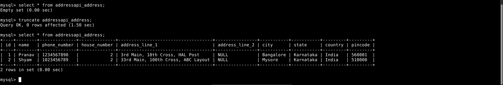

# Address Book Management with Rest Framework

This project uses DRF, Viewsets and Routers to greatly simplify API development.

<a href="https://download-directory.github.io?url=https://github.com/pranav-nambiar/address-book-management/tree/main/WithRestFramework"> Download this directory </a>

### POST Request

## Changes reflected in the database after POST requests

## GET all addresses

## GET one address by ID

## PATCH one address by ID

## Changes reflected in the database after PATCH request

## DELETE one address by ID

## Changes reflected in the database after DELETE request

