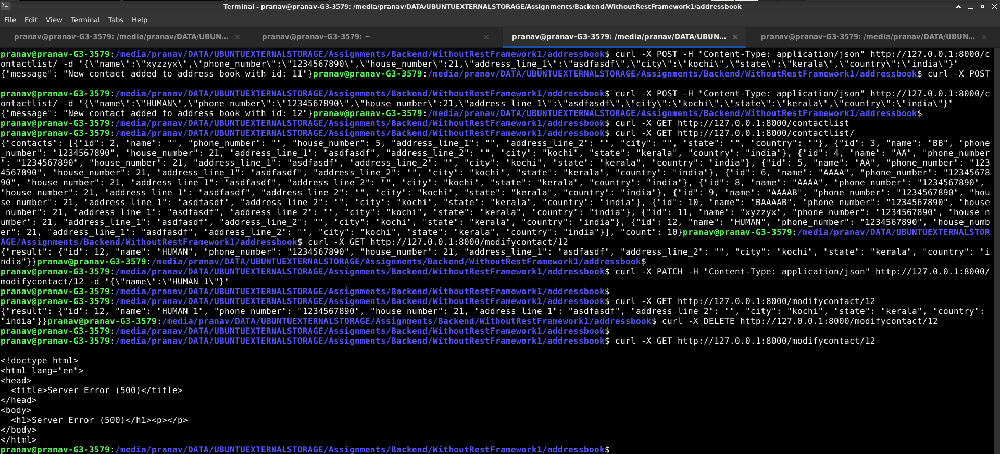

# Address Book Management without Rest Framework

This project does not use DRF, instead it implements an API manually. The codebase is complicated and much larger, which highlights how convenient DRF is for development. it makes generic views for CRUD operations easy to set up.

<a href="https://download-directory.github.io?url=https://github.com/pranav-nambiar/address-book-management/tree/main/WithoutRestFramework"> Download this directory </a>

## Querying API with cURL


## Sample queries
- POST Request
    ```
    curl -X POST -H "Content-Type: application/json" http://127.0.0.1:8000/contactlist/ -d "{\"name\":\"xyzzyx\",\"phone_number\":\"1234567890\",\"house_number\":21,\"address_line_1\":\"asdfasdf\",\"city\":\"kochi\",\"state\":\"kerala\",\"country\":\"india\"}"
    ```
- GET Request
    ```
    curl -X GET http://127.0.0.1:8000/contactlist/
    ```
- GET ONE Request
    ```
    curl -X GET http://127.0.0.1:8000/modifycontact/1
    ```
- PATCH Request
    ```
    curl -X PATCH -H "Content-Type: application/json" http://127.0.0.1:8000/modifycontact/1 -d "{\"name\":\"HUMAN_1\"}"
    ```
- DELETE Request
    ```
    curl -X DELETE http://127.0.0.1:8000/modifycontact/1
    ```
